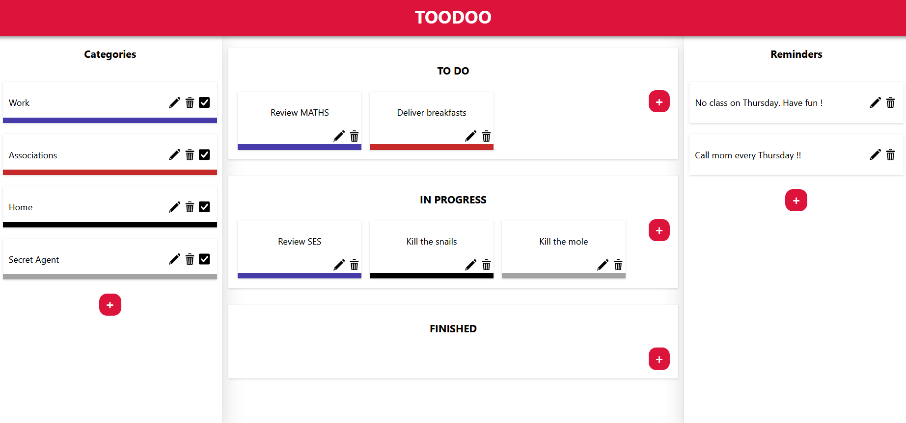
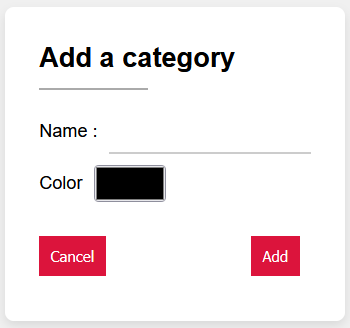
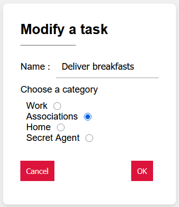

# TO-DO application
This application is a simplified TO-DO manager.

*General view of the application*

 

*Other views of the application*

### Launch the application

To launch it on your computer, run node app.js [number of port] :
~~~
    node app.js 8000 
~~~
### Credentials

Made with Enzo GELAS, Ewen Collin and Ghislaine GUIGUOUD